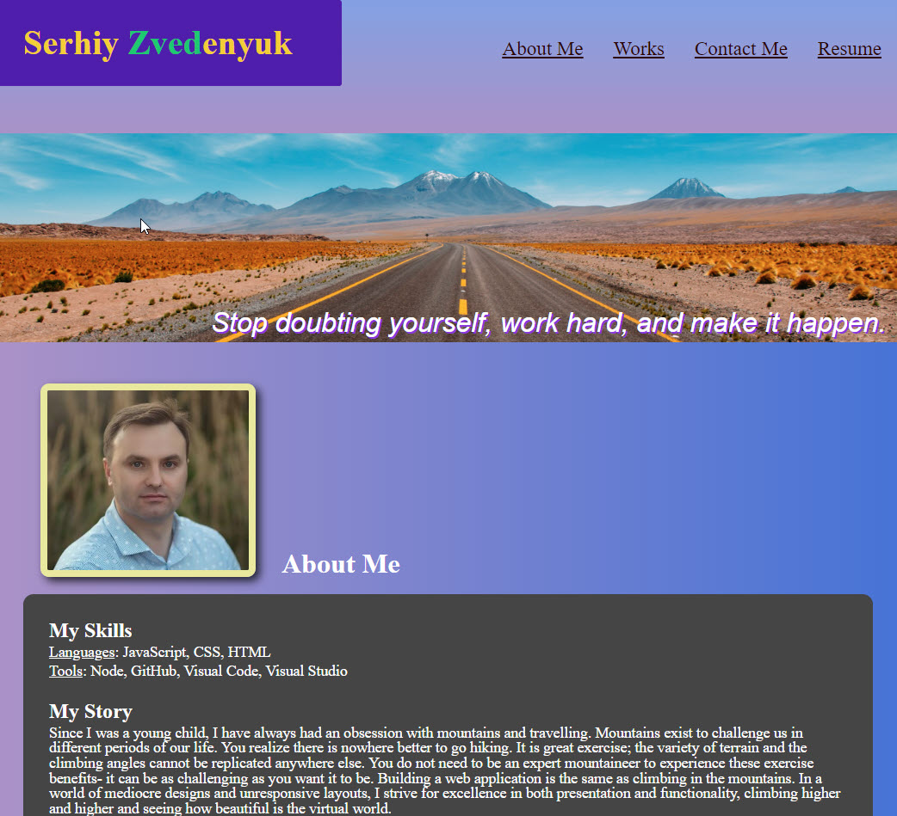
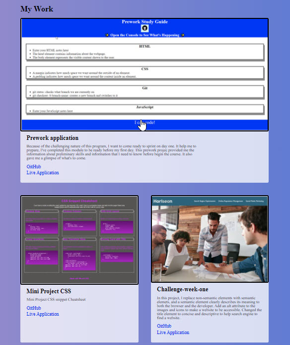

# My portfolio


## Project Description

Serhiy Zvedenyuk portfolio buildout 1.0. Developer leveraged several responsive CSS methods, including flexbox for Header and Footer layout and CSS grid to style Selected Works grid with media queries to adapt the layout to smaller screen sizes. 

## Tecnologies Used:

HTML
CSS

## GutHub Page

https://serhiyzv.github.io/serhiy-portfolio/

## Screenshots

```md

```
```md
